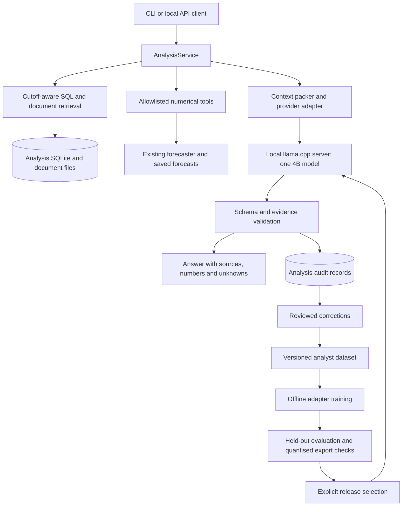

# System design and architecture

Status: current-code map plus proposed local analyst design, 2026-09-23. The local analyst, interfaces, tables, configuration keys and release workflow below are **planned**, not implemented or benchmarked. This document does not claim a model has been downloaded, trained or promoted.

Implementation sequence and acceptance criteria: [local LLM implementation plan](LOCAL_LLM_IMPLEMENTATION_PLAN.md). Numerical model details remain in [ML](ML.md), [primary models](PRIMARY_MODELS.md), [guarded improvements](GUARDED_IMPROVEMENTS.md) and [session mixtures](SESSION_MIXTURES.md).

## 1. Goals and first deployment

Build an evidence-grounded F1 analyst that runs locally, explains numerical results, extracts supported facts, identifies missing evidence and accumulates reviewed examples for later specialisation.

The first experiment is **Qwen3.5-4B, 4-bit weights, 4,096 total context tokens**, on a MacBook Air M1 with 8 GB unified memory and 256 GB storage. The context includes the rendered prompt, tool messages and generated response. It is not a 4,096-token input plus an unrestricted answer. The experiment begins at 4,096; reducing context is a separate experiment, never a silent adjustment. Qwen3.5-2B at the same context is the fallback candidate.

The numerical forecaster owns probabilities and rankings. The initial analyst reads evidence and saved forecasts without modifying them. Local inference, retrieval updates and weight training are separate operations. An adapter can specialise behaviour; it does not automatically improve forecast accuracy or learn from every conversation.

Non-goals for the first release: autonomous browsing, arbitrary code execution, multiple concurrent models, image ingestion, continuous online weight updates, full-parameter training on the Air, or replacing the primary numerical model.

## 2. Current implementation and integration boundaries

| Existing component | Current responsibility | Local analyst change |
| --- | --- | --- |
| `src/f1_forecast/models.py` | Pydantic snapshots, forecasts, sources, scenarios and feedback; extra fields forbidden | Reuse identifiers and validation conventions; add separate analysis contracts |
| `src/f1_forecast/service.py` | `ForecastService` chooses numerical policies, optional LLM planning/ordering, calibration and persistence | Preserve prediction behaviour; add an independent `AnalysisService` |
| `src/f1_forecast/llm.py` | Provider-specific structured parsing, web research, rating extraction and outcome advice | Introduce a provider boundary while retaining the existing public facade |
| `src/f1_forecast/api.py` | Local prediction/feedback routes; `use_llm` invokes the existing LLM path | Add separate analysis routes; do not reinterpret `use_llm` as explanation-only |
| `src/f1_forecast/store.py` | Forecasts, numerical learner versions and verified event feedback in SQLite | Keep those records intact; use a separate analysis database |
| `src/f1_forecast/training.py` | Verified outcome-order dataset export and explicit remote fine-tuning submission | Retain this workflow; add a distinct analyst dataset/training workflow |
| `src/f1_forecast/acceptance.py` | Chronological, paired, multi-metric numerical model screening | Reuse only when evaluating changes that affect forecast outputs |
| `src/f1_forecast/session_selection.py` | Session-specific guarded selection | Preserve incumbent and session-specific protections |

`LLM.parse()` currently calls `client.responses.parse()`. Research uses a provider-hosted web-search tool. A server advertising an API-compatible endpoint is not sufficient evidence of identical SDK parsing, schema, search, refusal or tool semantics. The local adapter must implement and test its own request/response mapping.

`ForecastService.predict()` currently passes LLM scenarios and ordering into the prediction path. Reusing that path for a supposedly read-only explanation would cross the intended boundary. Initially, compute a forecast with LLM influence disabled, save it, and analyse that saved forecast separately.

The existing training export labels only finishing order. Verified classifications are useful forecast labels, but are not reviewed explanations, evidence extraction labels or tool-use demonstrations. Do not rename that export as analyst training data.

## 3. Runtime topology

Use the existing Python application plus one native model-server process. Bind the application to `127.0.0.1:8000` and the model server to `127.0.0.1:8081`; reject an unexpected occupied port rather than killing another process. Use a native Apple-silicon build with Metal support. Do not introduce Docker, a broker or a separate vector database for the first deployment.

The preferred inference backend is llama.cpp with a pinned compatible build and pinned GGUF file. Begin with Q4_K_M if a verified compatible artifact exists; record the actual quantisation rather than trusting a filename. Text-only serving should avoid loading an image projector. Model provenance, tokenizer/chat template, license, source revision, artifact SHA-256 and runtime build are mandatory release metadata.

Only one request may use the model at a time. The first implementation rejects an additional request as busy rather than creating an unbounded queue. Cancelled/timed-out generation must actually release the server slot; closing the client connection alone must be tested. Keep expensive numerical training/backtests out of the inference session. Measure coexistence with an ordinary forecast separately.

The first workflow uses application-selected tools followed by one model call. Later model-requested tools are limited to two rounds and three tool executions per analysis, with at most three model calls. Every call independently respects 4,096 tokens. The service repacks selected evidence and compact results; it never appends unlimited conversation history.

## 4. Model selection and resource design

Qwen3.5 is the initial candidate because the family offers small checkpoints, published technical/tool evaluations, open weights and an Apache-2.0 license. These are selection reasons, not an F1 ranking. Compare Qwen3-4B-Instruct-2507 and Phi-4-mini-instruct after the first hardware experiment. Gemma 3 4B IT and Llama 3.2 3B Instruct are optional later candidates if initial choices fail a specific requirement. Evaluate each with the same tasks and comparable quantisation; do not assume equal parameter counts imply equal memory or latency.

Four billion parameters at exactly four bits would be about 2 GB of raw parameter bits. Real model files include mixed-precision tensors, scales and metadata; process memory also includes runtime buffers, attention/recurrent state and the prompt. This arithmetic is not an estimate of total RAM. macOS and the GPU share the 8 GB pool. The first run must measure actual memory and swap rather than assume fit from disk size.

### Context allocation

Initial packing envelope, in the selected model's tokens:

| Content | Budget |
| --- | ---: |
| Instructions and compact output schema | 400 |
| User question and identifiers | 200 |
| Compact numerical snapshot/forecast/tool results | 650 |
| Retrieved source passages | 1,750 |
| Chat-template overhead and packing margin | 328 |
| Maximum generated tokens | 768 |
| **Total** | **4,096** |

These are planning allocations, not assumptions about actual JSON token counts. Count the fully rendered template, including schema/tool definitions, using the exact deployed tokenizer. Enforce `rendered_prompt_tokens <= 3328` and `rendered_prompt_tokens + max_generated_tokens <= 4096`. Reallocate within the input envelope when necessary. If essential instructions/schema/facts cannot fit, return `context_budget_exceeded`; never truncate JSON, source quotes or roster fields blindly. Record omitted evidence IDs and why they were omitted. Server-side implicit context shifting/truncation must be disabled or detected and treated as failure.

Use the verified direct-answer/non-thinking template mode initially. A label in application configuration does not prove that the runtime honours it: inspect raw outputs and token usage. Any emitted reasoning counts against the generated-token allowance. If the pinned backend cannot reliably implement this profile, mark it incompatible; do not conceal reasoning overhead or silently change settings. Cap response content and use task-specific schemas rather than one oversized universal schema.

Plan one cached inference artifact, one retained known-good release and one candidate only when space permits. Reserve 20 GiB free before experiments as a conservative operating target; check actual download/export needs separately. Never automatically delete datasets, raw evidence or an active release. Training/merge exports may require much more disk than inference and must run on the selected training machine.

## 5. Provider and analysis contracts

Proposed modules are listed in the implementation plan. The provider interface should expose:

- `capabilities()`: structured output, tool requests, token counting, cancellation and supported reasoning controls.
- `count_tokens(rendered_messages, schema)`: exact accounting against the deployed template.
- `generate(request) -> ProviderResult`: parsed candidate content, raw response, finish reason, usage, timing and model identity.
- Normalised failures: unavailable, busy, timeout, context overflow, incomplete output, unsupported capability and invalid response.

Use existing `httpx` for the local transport; keep hosted-client imports optional. Fail clearly if schema enforcement is unsupported. Pydantic revalidation remains mandatory even when decoding is schema-constrained. Allow at most one format-repair attempt within the request deadline; log first-pass and repaired results separately. Transport failures do not cause endless retries or automatic cloud fallback.

### Public analysis contracts (proposed)

| Contract | Required content |
| --- | --- |
| `AnalysisRequest` | Question, task enum, forecast ID or explicit snapshot, analysis mode, request ID |
| `EvidenceRef` | Document/chunk ID, content hash, source times, quote offsets, provenance |
| `NumericFact` | Fact ID, tool/run ID, metric, value, unit, scenario/driver IDs, availability time |
| `AnalysisResult` | Analysis ID, status, concise summary, supported claims, numeric references, unknowns, limitations, model/release ID, timings |
| `AnalysisReview` | Analysis ID, accepted/corrected/rejected, corrected answer, rubric labels, reviewer ID, reviewed-at time |

For forecast explanations, derive the cutoff from the saved snapshot; a caller cannot advance it to admit future evidence. Explicit post-event analysis has its own mode and cutoff and is never labelled as a pre-event forecast. A self-reported LLM confidence score is not a calibrated probability.

Numbers in the rendered answer should be substituted from validated `NumericFact` references by the application. Reject invented fact IDs or mismatched units. Validate quote offsets against the exact archived text and require source support for substantive claims. Exact quote matching establishes traceability, not entailment: semantic support remains part of reviewed evaluation. Store invalid raw responses as failed analyses, not successful training examples.

Proposed routes: `POST /analyses`, `GET /analyses/{analysis_id}`, `POST /analyses/{analysis_id}/reviews`, `GET /analysis/model`. Missing records return 404, invalid inputs 422, busy requests 429, unavailable/incompatible model 503 and deadline expiry 504. An evidence-insufficient answer is a successful domain result with status `insufficient_evidence`, not a fabricated conclusion. Existing `/model` continues to describe numerical learner state.

## 6. Retrieval and data provenance

Use SQLite FTS5 for lexical document search and ordinary indexed SQL for identifiers, dates and numeric facts. Check FTS5 availability at startup; do not silently return an empty result set if unsupported. Start with text/JSON imports; later HTML/PDF ingestion must preserve original files, parser version and text hashes.

Proposed storage in `data/analysis.sqlite3`:

| Table | Purpose and key constraints |
| --- | --- |
| `schema_migrations` | Ordered migration IDs and checksums |
| `documents` | Immutable version ID, source URL, text hash, archived path, event/session, published/retrieved/available times, availability basis, verification state |
| `chunks` plus FTS index | Stable ID, document version, offsets, text hash, tokenizer/chunker version |
| `analysis_runs` | Request, forecast reference and hash, cutoff/mode, release, prompt/evidence hashes, status, response, usage/timing/error |
| `analysis_evidence` | Ordered chunk IDs and retrieved/selected/omitted decisions per run |
| `tool_runs` | Validated arguments, output hash, numerical model/seed and timing |
| `analysis_reviews` | Append-only decisions/corrections; supersedes link for corrections |
| `dataset_examples` | Reviewed example lineage, task, weekend/document group, split and version |
| `model_releases` | Immutable manifest reference/hash and evaluation decision |

Use transactions, foreign keys, short-lived database connections and bounded busy timeouts. Additive migrations must preserve earlier runs. Review submission is idempotent by request ID; conflicting corrections create new revisions rather than rewriting old evidence. Keep synthetic fixtures isolated from real-data exports.

Retrieval sequence:

1. Validate task/mode and derive the allowed cutoff.
2. Filter documents by eligible event/session, provenance and availability **before** ranking.
3. Search text and rank with FTS; combine exact identifier matching and configurable task filters.
4. Deduplicate versions/passages and choose a small diverse set that fits the token budget.
5. Return original passage references; never use an earlier LLM summary as a primary source without its underlying evidence.

For live capture, eligibility defaults to the later of retrieval/publication times when both exist. Missing publication time uses retrieval time and retains the missingness flag. An earlier historical `available_at` requires documented archival evidence and review; a present-day article claiming an earlier date is insufficient. Keep `retrieved_at` separate and label reconstructed historical availability. The initial analyst can use the conservative retrieval-time policy; archival overrides require their own implementation and tests. Exclude target-event results in pre-event mode even if retrieval metadata is malformed. Audit all exclusion decisions.

Document instructions are untrusted data. Tool names and arguments come through a validated allowlist. Retrieval never grants shell, arbitrary SQL or filesystem access. Network collection is an explicit separate operation; normal analysis works offline after artifacts are installed.

## 7. Numerical tools and forecast isolation

First-release tools are application-controlled readers: retrieve a saved forecast, compare stored scenario probabilities, and summarise stored input quality. Tools return compact typed facts with units and provenance. They cannot update feedback, ratings or active models.

Later add explicit what-if simulations using copied snapshots and bounded parameters. Record seed, simulation count, model identity, changed assumptions and baseline hash. Label outputs as conditional model results, not established causal effects. Run simulations before loading the LLM when memory pressure requires it. Do not claim a scenario or measured pace tool exists until implemented against available source data.

A future forecast-affecting mode must be separate from analysis and explicitly configured. It requires chronological numerical evaluation, complete paired weekends/seeds, session-specific checks and all protected metrics. Historical LLM recall can contaminate replay even with timestamp filtering. Freeze live forecasts before outcomes for prospective evidence. Failure or insufficient evidence retains the incumbent.

## 8. Specialist learning lifecycle

Maintain three separate forms of growth:

1. New verified documents extend retrieval without changing weights.
2. Reviewed corrections improve prompts, tools and evaluation fixtures.
3. Versioned supervised datasets train optional model-specific adapters offline.

An analyst example contains task/question, pre-cutoff evidence, tool results, reviewed target answer, source lineage, review time, synthetic flag and grouping key. Review acceptance alone is not proof of factual quality; use the rubric and verify sources/numbers. Avoid training on unsupported generated explanations. Store concise justifications where useful; do not require private reasoning traces.

Split chronologically by whole weekend, with duplicate/near-duplicate documents and paraphrases grouped together. Non-event examples use source-document groups and availability dates. Purge labels/reviews unavailable at the training freeze and later validation boundary. Preserve a final untouched test set. Record exclusions, hashes and all split membership. A later-season score does not eliminate pretraining contamination; label it retrospective.

On this 8 GB Mac, 4B inference is the first objective. Do not assume 4B fine-tuning fits. First conduct a separately budgeted training feasibility probe with a supported backend and a smaller model if all work must stay local. MLX compatibility and adapter export must be proven for the exact architecture. An optional larger training machine can train the selected 4B model and return a release for local inference; no remote job or dataset upload is implicit in this design.

Use LoRA initially, freezing base weights, with a small predeclared search over rank, learning rate and epoch count. Keep the base checkpoint and chat template fixed. Compare validation performance and general task regressions, then evaluate the chosen adapter once on the held-out test set. Test the final quantised export separately: training scores do not establish exported-runtime quality. A 4B adapter is not compatible with 2B; datasets/tools transfer, adapters do not.

## 9. Releases, failure handling and observability

A release manifest records base/model revision, tokenizer/template hash, artifact and adapter hashes, quantisation, runtime build, context/output limits, prompt/schema/retrieval versions, dataset and split hashes, test report, license metadata and creation time. Model caches must key on these versions plus request/evidence/tool hashes; disable answer caching initially.

Stage and verify the candidate, stop the old process, start the selected release, verify health/model identity and run a smoke task. Update the active release pointer atomically only after success. Keep the old artifact for rollback; never load both at once on the Air. Reject mismatched adapter/base metadata. A failed release leaves analysis unavailable or rolls back explicitly; numerical prediction remains independently available.

Log load time, rendered input/output token counts, finish reason, first-token latency, end-to-end latency, throughput, first-pass schema validity, repairs, source/number checks and abstentions. Hardware experiments additionally record process peak memory, system memory pressure, swap deltas, power mode, background applications and cold/warm state. Avoid adding process and GPU figures that count the same unified memory twice.

Timeouts, cancellation, server exits and invalid outputs retain traceable failed run records. Do not label an incomplete response valid. On restart, mark unfinished run records interrupted. Back up the analysis database and immutable document/release manifests before migrations; rebuild FTS from archived chunks and verify hashes. Bind locally with no public exposure; authentication becomes a separate prerequisite if deployment scope expands beyond this single-user machine.

## 10. External references and verification limits

References checked 2026-09-23; pin exact artifacts and tool versions during implementation because upstream support changes.

- [Qwen3.5-4B model card](https://huggingface.co/Qwen/Qwen3.5-4B): model identity, license and published capabilities. Published large-context benchmarks do not validate the planned 4,096-token profile.
- [Qwen3.5-2B model card](https://huggingface.co/Qwen/Qwen3.5-2B): smaller fallback; independently evaluate it.
- [Qwen3-4B-Instruct-2507](https://huggingface.co/Qwen/Qwen3-4B-Instruct-2507) and [Phi-4-mini-instruct](https://huggingface.co/microsoft/Phi-4-mini-instruct): comparison candidates.
- [llama.cpp server documentation](https://github.com/ggml-org/llama.cpp/blob/master/tools/server/README.md): native serving, context configuration, structured JSON and tokenisation features. Compatibility still needs a pinned-build smoke test.
- [MLX LM](https://github.com/ml-explore/mlx-lm): Apple-silicon inference/fine-tuning ecosystem; exact checkpoint support is a feasibility gate.
- [Unsloth Qwen3.5 fine-tuning guidance](https://unsloth.ai/docs/models/qwen3.5/fine-tune): currently warns against 4-bit QLoRA for this family and reports roughly 10 GB GPU memory for its 4B BF16 LoRA setup. Those CUDA-oriented figures do not establish Mac requirements.
